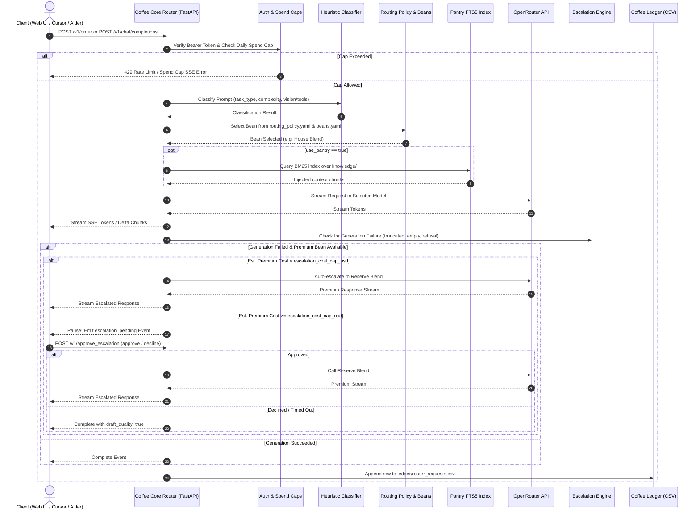

# Project Coffee: Exploratory Analysis for Public Release

This document provides a comprehensive exploratory analysis of Project Coffee in preparation for its first public open-source release. Every factual claim is cited with source file paths. Inferred conclusions are explicitly marked as **(inferred)**.

---

## 1. Purpose

Project Coffee is a personal AI operating workstation and local engineering operating system built around an intelligent model router. At its core, it hosts a local FastAPI service that classifies prompts, dynamically routes them to cost-appropriate LLM models ("Beans") via OpenRouter, and exposes both a custom Server-Sent Events (SSE) streaming endpoint (`POST /v1/order`) and an OpenAI-compatible endpoint (`POST /v1/chat/completions`) for tools like Cursor, Continue, or Aider ([router/app/main.py:2439-2625](router/app/main.py#L2439-L2625), [router/README.md:26-33](router/README.md#L26-L33)). Beyond simple proxying, the ecosystem includes an animated browser chat client ([web/README.md](web/README.md)), local benchmark evaluations ([roastery/run_cup_test.py](roastery/run_cup_test.py)), grounded knowledge base retrieval ([router/app/pantry.py](router/app/pantry.py)), transparent financial cost tracking ([router/app/ledger.py](router/app/ledger.py)), and an empirical feedback loop that rebuilds routing policies from real usage ratings ([tools/generate_policy.py](tools/generate_policy.py)).

### Confirmation and Correction of User Prompt
- **User's description**: *"It is an AI model router built on OpenRouter that exposes an OpenAI-compatible HTTP endpoint."*
- **Verification from code**:
  - **Confirmed**: The executable core is indeed a local model routing service built on OpenRouter that exposes an OpenAI-compatible chat completions endpoint at `POST /v1/chat/completions` ([router/app/main.py:2499](router/app/main.py#L2499), [router/app/openrouter_client.py:110](router/app/openrouter_client.py#L110)).
  - **Clarification / Extension**: Project Coffee is broader than just the router. The repository contains a full personal AI engineering operating system ([PROJECT_COFFEE.md:3-14](PROJECT_COFFEE.md#L3-L14), [ARCHITECTURE.md:20-89](ARCHITECTURE.md#L20-L89)), featuring a Next.js 16 web UI ("Coffee Counter Chat UI" in [web/](web)), a model benchmarking lab ("Roastery" in [roastery/](roastery)), a SQLite BM25 knowledge retrieval engine ("Pantry" in [router/app/pantry.py](router/app/pantry.py)), a strict spend-capping system ([router/app/main.py:214-256](router/app/main.py#L214-L256)), and file-based session memory management ([router/app/memory_proposals.py](router/app/memory_proposals.py)).

---

## 2. Architecture

### Main Components
1. **Client Tier**:
   - **Coffee Counter Chat UI** ([web/](web)): Next.js 16 (App Router, Turbopack) + React 19 + Tailwind v4 + Zustand web interface connecting to `POST /v1/order` via SSE ([web/src/lib/api.ts](web/src/lib/api.ts)).
   - **Third-Party OpenAI Clients** (Cursor, Continue.dev, Aider, OpenAI SDK): Connect to `POST /v1/chat/completions` ([router/README.md:172-183](router/README.md#L172-L183)).
   - **CLI & Diagnostic Tools** ([tools/coffee.py](tools/coffee.py)): Unified CLI for repository health, ledger analysis, and pantry search.
2. **Coffee Core Router** ([router/app/](router/app)):
   - **Auth Gate** ([router/app/auth.py](router/app/auth.py)): Validates 64-character hex Bearer tokens generated upon `POST /v1/login`.
   - **Spend Cap Enforcer** ([router/app/main.py:214-256](router/app/main.py#L214-L256)): Evaluates pre-call estimates against rolling UTC daily user and global budgets.
   - **Classifier** ([router/app/classifier.py](router/app/classifier.py)): Rule-based heuristic scoring task type (`code`, `refactor`, `doc`, `analysis`, `research`, `explain`) and complexity (`espresso_shot` vs. `cold_brew`).
   - **Routing Engine** ([router/app/routing.py](router/app/routing.py)): Selects primary/fallback bean based on `routing_policy.yaml` and capability constraints (vision, tool calling).
   - **Pantry Retrieval** ([router/app/pantry.py](router/app/pantry.py)): Searches SQLite FTS5 index (`data/pantry_index.db`) over `knowledge/` and injects relevant snippets into the prompt.
   - **OpenRouter Streaming Client** ([router/app/openrouter_client.py](router/app/openrouter_client.py)): Asynchronous `httpx` client communicating with `https://openrouter.ai/api/v1/chat/completions`.
   - **Escalation Engine** ([router/app/escalation.py](router/app/escalation.py)): Inspects stream outputs for truncation, refusal, or emptiness. Automatically escalates or pauses for human approval card display.
   - **Ledger** ([router/app/ledger.py](router/app/ledger.py)): Appends request records, token metrics, and cost data to `ledger/router_requests.csv`.
   - **Storage** ([router/app/sessions.py](router/app/sessions.py)): SQLite database (`router/data/sessions.db`) tracking sessions, messages, users, tokens, and API requests.

### Request Flow and Escalation Decision Path


---

## 3. Project Vocabulary

The codebase uses a domain-specific coffee taxonomy. Every term maps directly to a concrete software component:

| Term | Meaning in Code | Defining File(s) |
| :--- | :--- | :--- |
| **Beans** | Model configurations and aliases mapped to raw OpenRouter model IDs (e.g., `nvidia/nemotron-3-ultra-550b-a55b:free`, `anthropic/claude-sonnet-4.6`). Loaded into `BeanRegistry`. Raw provider IDs are hidden from client responses. | [router/app/aliases.py:29-52](router/app/aliases.py#L29-L52), [router/config/beans.yaml](router/config/beans.yaml) |
| **House Blend** | The primary default model-routing policy for routine tasks (`role: default` in `beans.yaml`, mapped to Nemotron 3 Ultra Free). | [router/config/beans.yaml:15-27](router/config/beans.yaml#L15-L27), [router/config/routing_policy.yaml](router/config/routing_policy.yaml) |
| **Reserve Blend** | The designated premium model (`role: premium` in `beans.yaml`, mapped to Claude Sonnet 4.6), reserved for escalation when cheap models fail or complexity demands it. | [router/config/beans.yaml:51-68](router/config/beans.yaml#L51-L68) |
| **Second Pour** | Fallback free-tier model (`role: fallback` in `beans.yaml`, mapped to Cohere North Mini Code Free) used if the default bean is unavailable. | [router/config/beans.yaml:29-38](router/config/beans.yaml#L29-L38) |
| **Single Origin** | Specialist model (`role: specialist` in `beans.yaml`, mapped to Claude Haiku 4.5). | [router/config/beans.yaml:70-79](router/config/beans.yaml#L70-L79) |
| **Guest Bean** | Comparison model (`role: comparison` in `beans.yaml`, mapped to Poolside Laguna Free). | [router/config/beans.yaml:40-49](router/config/beans.yaml#L40-L49) |
| **Flat White** | Specialist low-cost multimodal bean (`role: specialist`, mapped to Gemini 2.5 Flash Lite). | [router/config/beans.yaml:134-143](router/config/beans.yaml#L134-L143) |
| **Day Roast** | Comparison multimodal bean (`role: comparison`, mapped to Gemma 4 31B IT Free). | [router/config/beans.yaml:164-173](router/config/beans.yaml#L164-L173) |
| **Brew** | A discrete project milestone or developmental iteration (e.g., Brew 36 through Brew 57), tracked chronologically across project memory. | [brew-log/active_context.md](brew-log/active_context.md), [brew-log/progress.md](brew-log/progress.md) |
| **Coffee Counter** | Two meanings: (1) Architecture Layer 1: the human operating surface (Cursor, VS Code, CLI) ([ARCHITECTURE.md:27-31](ARCHITECTURE.md#L27-L31)); (2) The literal chat frontend ("Coffee Counter Chat UI" in [web/](web) and Streamlit panel in [ui/coffee_counter_app.py](ui/coffee_counter_app.py)). | [ARCHITECTURE.md:10-18](ARCHITECTURE.md#L10-L18), [web/README.md:1-12](web/README.md#L1-L12) |
| **Pantry** | Curated local knowledge base (`knowledge/` and legacy `pantry/`). Chunked and indexed into a SQLite FTS5 table (`data/pantry_index.db`) for BM25 retrieval into prompts. | [router/app/pantry.py:1-46](router/app/pantry.py#L1-L46), [knowledge/00_index.md](knowledge/00_index.md) |
| **Brew Log** | Project memory archive capturing active context, progress, architectural decisions, and mistakes (`brew-log/active_context.md`, `progress.md`). | [brew-log/](brew-log), [router/app/memory_proposals.py](router/app/memory_proposals.py) |
| **Roastery** | Empirical evaluation system for models, prompts, and workflows. Houses benchmark prompts (`cup_tests/`), runner scripts, and scorecards. | [roastery/](roastery), [roastery/run_cup_test.py](roastery/run_cup_test.py) |
| **Cup Test** | Standardized benchmark evaluation prompt executed against models through OpenRouter to measure output quality and instruction adherence. | [roastery/run_cup_test.py](roastery/run_cup_test.py), [roastery/cup_tests/README.md](roastery/cup_tests/README.md) |
| **Tasting Notes** | Scorecards, failure logs, and quantitative observations generated from Cup Tests and live demos. | [roastery/tasting_notes.md](roastery/tasting_notes.md) |
| **Coffee Ledger** | Financial and token accounting system. Maintained automatically in `ledger/router_requests.csv` per request, and narratively in `ledger/cost_log.md`. | [router/app/ledger.py:1-28](router/app/ledger.py#L1-L28), [ledger/cost_log.md](ledger/cost_log.md) |
| **Spill Guard** | Privacy, secret prevention, and path safety subsystem. Enforces ignore rules (`.gitignore`, `.cursorignore`), path safety checks, and secret regex scanning. | [tools/coffee_context_package.py:22-63](tools/coffee_context_package.py#L22-L63), [router/app/config.py:92-114](router/app/config.py#L92-L114) |
| **Decaf Mode** | Read-only planning, exploration, and verification mode. Forbids file edits, dependency installations, and destructive commands. | [PROJECT_COFFEE.md:27-35](PROJECT_COFFEE.md#L27-L35), [recipes/decaf-planning-recipe.md](recipes/decaf-planning-recipe.md) |
| **Espresso Shot** | Low-complexity, fast task requiring minimal context and zero file risk. Represents low complexity in the classifier. | [router/app/classifier.py:23](router/app/classifier.py#L23), [BARISTA_CHARTER.md:46](BARISTA_CHARTER.md#L46) |
| **Cold Brew** | Complex, multi-step, or long-context task. Triggered in classification by multi-step keywords, long history, attachments, or web search. | [router/app/classifier.py:23](router/app/classifier.py#L23), [BARISTA_CHARTER.md:47](BARISTA_CHARTER.md#L47) |
| **Barista** | The primary AI orchestrator persona that plans, routes, verifies, documents, and coordinates specialist agents. | [AGENTS.md:12-14](AGENTS.md#L12-L14), [baristas/barista_orchestrator.md](baristas/barista_orchestrator.md) |
| **Remember chat** | Per-session toggle (`remember_chat` in `sessions` table) dictating whether historical turns in `sessions.db` are injected into context. | [router/app/sessions.py:121](router/app/sessions.py#L121), [router/app/history.py:1-14](router/app/history.py#L1-L14) |
| **Tips Jar** | UI spending component in the web chat client showing real-time spend against the user's daily cost cap (`GET /v1/usage`). | [router/README.md:435-439](router/README.md#L435-L439), [web/src/components/Sidebar/](web/src/components/Sidebar) |
| **Order** | A prompt generation cycle initiated via `POST /v1/order` and processed through the SSE event lifecycle. | [router/app/main.py:2439](router/app/main.py#L2439), [router/EVENT_CONTRACT.md](router/EVENT_CONTRACT.md) |
| **Draft Quality** | Status flag assigned to an answer when escalation was declined, timed out, or blocked by cost cap, preserving the cheaper draft instead of failing. | [router/app/escalation.py:130](router/app/escalation.py#L130), [router/app/main.py:192-196](router/app/main.py#L192-L196) |
| **Shadow Mode** | Background sampling mode where a fraction of non-premium completions run silently against the premium bean to record comparison pairs. | [router/config/settings.yaml](router/config/settings.yaml), [router/app/main.py:2570-2615](router/app/main.py#L2570-L2615) |

---

## 4. Tech Stack

### Languages
- **Python**: Version `3.11.9` confirmed in runtime environment. Core service, CLI tools, tests.
- **TypeScript**: Version `^5` ([web/package.json:39](web/package.json#L39)). Web frontend components, state, and API client.
- **JavaScript**: Node.js runtime `v24.16.0` confirmed. Build scripts and asset budgets.
- **PowerShell**: Automation and service launching (`start.ps1`, `stop.ps1`).

### Frameworks & Key Dependencies (from Manifest Files)
- **Backend Service** ([router/requirements.txt](router/requirements.txt)):
  - `fastapi`: Web framework exposing REST & SSE endpoints.
  - `uvicorn`: ASGI web server.
  - `pydantic`: Schema validation and configuration models.
  - `httpx`: Asynchronous HTTP client for OpenRouter streaming calls.
  - `pyyaml`: YAML parser for config files (`beans.yaml`, `routing_policy.yaml`, `settings.yaml`).
  - `bcrypt`: Password hashing for user authentication ([router/app/auth.py:16](router/app/auth.py#L16)).
  - `tzdata`: Timezone data for system prompt composition.
  - `pypdf`: PDF text extraction for attachment processing ([router/app/uploads.py:22](router/app/uploads.py#L22); installed in environment).
  - `charset_normalizer`: Encoding detection for uploaded files ([router/app/uploads.py:20](router/app/uploads.py#L20); installed in environment).
  - `sqlite3`: Standard library with FTS5 support for session store and Pantry BM25 search.
- **Web Frontend** ([web/package.json](web/package.json)):
  - `next`: `16.2.10` (App Router, Turbopack dev server)
  - `react`: `19.2.4`, `react-dom`: `19.2.4`
  - `tailwindcss`: `^4`, `@tailwindcss/postcss`: `^4`
  - `zustand`: `^5.0.14` (Client state store in `web/src/store/chatStore.ts`)
  - `@rive-app/react-canvas`: `^4.29.5` (Interactive coffee scene animation)
  - `react-markdown`: `^10.1.0`, `remark-gfm`: `^4.0.1`, `shiki`: `^4.3.1` (Markdown and syntax highlighting)
  - `vitest`: `^4.1.10`, `@testing-library/react`: `^16.3.2` (Unit testing)
  - `@playwright/test`: `^1.61.1` (End-to-end browser testing)
  - `eslint`: `^9`, `eslint-config-next`: `16.2.10` (Linting)
- **Root Node Manifest** ([package.json](package.json)):
  - `uuid`: `^14.0.1`
- **Legacy UI** ([apps/coffee-status/requirements.txt](apps/coffee-status/requirements.txt), [ui/README.md:43](ui/README.md#L43)):
  - `streamlit` (Optional legacy control panels in `apps/coffee-status` and `ui/`)

---

## 5. Directory Map

- `.cursor/`: Cursor editor configuration, rules, and slash command templates.
- `.gitignore`: Git exclusion patterns defining the repository Spill Guard safety boundary.
- `.cursorignore` / `.cursorindexingignore`: Editor indexing filters keeping sensitive files out of IDE models.
- `AGENTS.md`: Operating constitution and safety instructions for coding agents working in the repo.
- `ARCHITECTURE.md`: High-level 10-layer architectural design specification and modularity principles.
- `BARISTA_CHARTER.md`: Charter defining orchestrator responsibilities, operating modes, and safety gates.
- `BARISTA_OPERATING_MANUAL.md`: Step-by-step procedures for planning, routing, verifying, and learning.
- `CHANGELOG.md`: Chronological changelog tracking development history from initial commit to Brew 57.
- `COFFEE_CONSTITUTION.md`: Governing articles defining human control, autonomy limits, and truthfulness.
- `COFFEE_PRINCIPLES.md`: Core engineering philosophy guiding technical decisions.
- `COFFEE_TERMINOLOGY.md`: Shared vocabulary definitions mapping coffee metaphors to engineering roles.
- `COFFEE_VALUES.md`: Principles defining the working partnership between operator and agent.
- `DECISIONS/`: Architecture Decision Records (ADRs 0001 through 0004).
- `EVALUATION_AND_ROASTERY.md`: Evaluation framework for model benchmarking and scorecards.
- `GOVERNANCE_AND_SAFETY.md`: Privacy guidelines, approval gates, and sensitive data guardrails.
- `KNOWLEDGE_ARCHITECTURE.md`: Pantry structural design, indexing policies, and freshness reviews.
- `MEMORY_AND_LEARNING.md`: Long-term memory architecture and learning feedback loop designs.
- `PHASE_0_ROADMAP.md`: Phase 0 foundation deliverables and exit criteria.
- `PLAN-*.md` / `PLANS-INDEX.md`: Historical implementation plans and index for previous refactoring brew passes.
- `PROJECT_COFFEE.md`: Workspace rules, Decaf mode definition, and core operating principles.
- `README.md`: Root project readme (currently contains legacy Phase 0 draft).
- `ROADMAP.md`: Multi-phase product roadmap covering Phase 0 through future distribution goals.
- `TEMPLATES/`: Reusable starter templates for project briefs, recipes, scorecards, and lessons.
- `VISION.md`: High-level project vision: "Don't chase models. Build systems that outlive them."
- `agents/`: Markdown instruction cards for specialized assistant personas (`cappuccino`, `mocha`, etc.).
- `apps/`: Satellite applications (`coffee-status` Streamlit app, `coffee-certification` checker).
- `baristas/`: Early role specifications for the main orchestrator agent.
- `brew-log/`: Project memory repository (`active_context.md`, `progress.md`, `decisions.md`).
- `config/`: Root-level configuration files (`house_blend.md`).
- `docs/`: In-depth design documents, architecture specs, user guides, and build summaries.
- `evals/`: Placeholder directory for future automated evaluation suites.
- `examples/`: Placeholder directory for sample workflows and recipes.
- `fleet/`: Multi-project workspace registration and tracking configuration (`projects.example.json`).
- `knowledge/`: Active Pantry knowledge base indexed by the router for prompt retrieval.
- `ledger/`: Financial tracking directory (`cost_log.md`, `router_requests.csv`, `token_log.md`).
- `package.json` / `package-lock.json`: Root Node manifest specifying `uuid`.
- `pantry/`: Secondary/scaffold knowledge documentation, standards, and datasheets.
- `prompts/`: Curated prompt archive and shot templates.
- `recipes/`: Reusable, verified engineering workflows and checklist recipes.
- `roastery/`: Model evaluation harness (`run_cup_test.py`) and benchmark logs (`tasting_notes.md`).
- `router/`: The core FastAPI model router backend, tests, and configuration files.
- `scripts/`: Directory for repository automation scripts.
- `start.ps1`: PowerShell orchestrator script launching both backend router and frontend web UI.
- `stop.ps1`: PowerShell cleanup script force-terminating processes bound to ports 8765 and 3000.
- `tests/`: Root Python test suite covering CLI tools, dashboard, doctor, and ledger.
- `tools/`: Unified CLI tool (`coffee.py`), secret scanner, policy generator, and health utilities.
- `ui/`: Legacy Streamlit control panel (`coffee_counter_app.py`).
- `web/`: Next.js 16 chat interface ("Coffee Counter Chat UI").

---

## 6. Configuration

### Environment Variables

| Variable | Required | Default | Where Read | Description |
| :--- | :--- | :--- | :--- | :--- |
| `OPENROUTER_API_KEY` | **Yes** (for live model calls) | None | [router/app/openrouter_client.py:110](router/app/openrouter_client.py#L110), [roastery/openrouter_client.py:40](roastery/openrouter_client.py#L40), [start.ps1:84](start.ps1#L84) | OpenRouter API authentication key. Read only from environment; never stored in files or emitted in API payloads. |
| `COFFEE_ROUTER_FORCE_ESCALATION` | No | Unset (`None`) | [router/app/main.py:129](router/app/main.py#L129) | Demo/testing flag. When set to `"1"`, forces every generation to simulate a failure to exercise the escalation flow. |
| `CORS_ALLOWED_ORIGINS` | No | `http://localhost:3000` | [router/app/main.py:144](router/app/main.py#L144), set by [start.ps1:120](start.ps1#L120) | Comma-separated list of origins allowed by the router's CORS middleware. |
| `COFFEE_LAN_IP` | No | Author's addresses hardcoded in `start.ps1:74` (to be replaced) | [start.ps1:48](start.ps1#L48), [start.ps1:105](start.ps1#L105) | Comma-separated LAN and Tailscale IPs used by `start.ps1` to configure CORS and frontend router URLs. |
| `NEXT_PUBLIC_ROUTER_URL` | No | `http://127.0.0.1:8765` | [web/src/lib/api.ts:14](web/src/lib/api.ts#L14), set by [start.ps1:135](start.ps1#L135) | The URL the web frontend connects to for router API calls. Inlined by Next.js at build/dev start. |

### Configuration Files

#### 1. `router/config/beans.yaml`
Maps coffee aliases to OpenRouter model IDs, capabilities (`vision`, `code`, `tool_calling`), and token pricing per 1,000 tokens. Hand-maintained.
- Models configured: House Blend (`nvidia/nemotron-3-ultra-550b-a55b:free`), Second Pour (`cohere/north-mini-code:free`), Guest Bean (`poolside/laguna-m.1:free`), Reserve Blend (`anthropic/claude-sonnet-4.6`), Single Origin (`anthropic/claude-haiku-4.5`), Kimi K2 (`moonshotai/kimi-k2`), DeepSeek V3.2 (`deepseek/deepseek-v3.2`), Flat White (`google/gemini-2.5-flash-lite`), Day Roast (`google/gemma-4-31b-it:free`).

#### 2. `router/config/routing_policy.yaml`
Generated artifact created by `python tools/generate_policy.py`. **Never hand-edited**. Maps classified `task_types` (`code`, `refactor`, `doc`, `analysis`, `research`, `explain`) to primary, fallback, and premium beans based on Roastery evidence and real user ratings.

#### 3. `router/config/settings.yaml` (Loaded by [router/app/config.py](router/app/config.py))

| Setting | Default | Type | Description |
| :--- | :--- | :--- | :--- |
| `escalation_cost_cap_usd` | `0.50` | float | Threshold above which auto-escalation pauses for human approval. |
| `escalation_approval_timeout_seconds` | `600.0` | float | Timeout in seconds before an unapproved escalation auto-declines. |
| `sse_heartbeat_interval_seconds` | `15.0` | float | Heartbeat cadence during idle periods in SSE streams. |
| `generating_tick_tokens` | `20` | int | Token count threshold between SSE generating ticks. |
| `generating_tick_seconds` | `2.0` | float | Max seconds between SSE generating ticks. |
| `request_timeout_seconds` | `60` | int | HTTP client timeout for OpenRouter API requests. |
| `classifier_model_fallback_enabled` | `false` | bool | Whether to invoke a cheap model when heuristic classification confidence is low. |
| `classifier_model_fallback_bean_alias` | `"House Blend"` | string | Bean alias to use for model classification fallback. |
| `truncation_min_expected_tokens` | `32` | int | Minimum tokens below which non-length finish reason is flagged as truncated. |
| `refusal_keywords` | `[]` | list[str] | Substrings in generation output indicating model refusal. |
| `max_upload_size_bytes` | `20971520` (20 MB) | int | Maximum file size for attachment uploads. |
| `pdf_min_extracted_chars` | `20` | int | Minimum extracted characters from PDF before flagging OCR needed. |
| `max_inline_text_chars` | `50000` | int | Maximum text characters stored from an uploaded document. |
| `upload_ttl_seconds` | `3600` (1 hr) | int | Time-to-live for ephemeral upload records. |
| `memory_proposal_bean_alias` | `"House Blend"` | string | Bean alias used to draft memory diff proposals. |
| `memory_proposal_max_transcript_chars` | `20000` | int | Maximum transcript characters processed for a memory proposal. |
| `pantry_chunk_size_chars` | `1200` | int | Window character size for Pantry FTS5 chunks. |
| `pantry_chunk_overlap_chars` | `200` | int | Character overlap between consecutive Pantry chunks. |
| `pantry_top_k` | `5` | int | Number of top Pantry chunks retrieved per query. |
| `min_rating_sample_size` | `5` | int | Minimum rating count before user ratings influence policy rebuilds. |
| `policy_roastery_weight` | `0.6` | float | Weight of Roastery Cup Test evidence vs. ratings (0.4) in policy rebuilds. |
| `escalation_rate_flag_threshold` | `0.3` | float | Escalation frequency threshold to trigger advisory warnings in rebuilds. |
| `history_max_messages` | `20` | int | Max message count retained when `remember_chat` is enabled. |
| `history_max_chars` | `24000` | int | Max character budget for conversation history. |
| `attachment_max_stored_chars` | `50000` | int | Max character storage for attachments in conversation turns. |
| `classifier_long_history_turns` | `10` | int | Turn count threshold triggering cold brew classification. |
| `retry_detection_window_seconds` | `300.0` | float | Sliding window to identify repeated completions as retries. |
| `shadow_mode_enabled` | `false` | bool | Whether background shadow sampling is enabled. |
| `shadow_mode_sample_rate` | `0.1` | float | Fraction of non-premium completions shadowed against premium bean. |
| `shadow_mode_daily_cost_cap_usd` | `1.00` | float | Daily cost ceiling for shadow sampling. |
| `shadow_response_max_stored_chars` | `20000` | int | Character storage limit for shadow responses in `sessions.db`. |
| `per_user_daily_cost_cap_usd` | `1.00` | float | Rolling UTC daily spend cap per user account. |
| `global_daily_cost_cap_usd` | `5.00` | float | Rolling UTC daily spend cap aggregated across all users. |
| `per_user_requests_per_minute` | `20` | int | Request rate limiter per user. |
| `spend_cap_assumed_output_tokens` | `1000` | int | Conservative token count used when estimating pre-call costs. |
| `web_search_engine` | `"parallel"` | string | Search engine passed to OpenRouter (`parallel`, `exa`, `auto`). |
| `preferred_web_search_bean_alias` | `"Kimi K2"` | string | Tool-calling bean preferred for web search requests. |
| `system_prompt_include_date` | `true` | bool | Whether to inject current date into system message on `/v1/order`. |
| `system_prompt_timezone` | `"local"` | string | Timezone identifier for date system message (`"local"` or IANA name). |
| `system_prompt_include_identity` | `true` | bool | Whether to inject Project Coffee self-knowledge identity block into `/v1/order`. |

---

## 7. Setup and Run

### Prerequisites
- Python 3.11+
- Node.js 20+ (Node v24.16.0 confirmed in environment)
- npm 10+ (npm 11.13.0 confirmed in environment)
- OpenRouter API key

### 1. Installation

#### Windows (PowerShell)
```powershell
# 1. Install Python dependencies
pip install -r router/requirements.txt
# Additional document processing dependencies:
pip install pypdf charset_normalizer

# 2. Install web frontend dependencies
cd web
npm install
cd ..

# 3. Build the Pantry search index
python router/tools/index_pantry.py

# 4. Create an initial local user account
python router/tools/manage_users.py add
```

#### macOS / Linux (inferred)
```bash
# 1. Install Python dependencies
pip3 install -r router/requirements.txt
pip3 install pypdf charset_normalizer

# 2. Install web frontend dependencies
cd web
npm install
cd ..

# 3. Build the Pantry search index
python3 router/tools/index_pantry.py

# 4. Create an initial local user account
python3 router/tools/manage_users.py add
```

### 2. Starting the Services

#### Option A: Quickstart Script (Windows PowerShell only)
```powershell
$env:OPENROUTER_API_KEY = "sk-or-v1-..."
.\start.ps1
```
*Note: To allow access from other devices on the LAN, supply the host LAN IP:*
```powershell
.\start.ps1 -LanIp 192.168.1.50
```

#### Option B: Manual Two-Process Launch (All Platforms)

**Terminal 1 (router backend):**
- Windows PowerShell:
  ```powershell
  $env:OPENROUTER_API_KEY = "sk-or-v1-..."
  python -m uvicorn router.app.main:app --host 0.0.0.0 --port 8765
  ```
- macOS / Linux (inferred):
  ```bash
  export OPENROUTER_API_KEY="sk-or-v1-..."
  python3 -m uvicorn router.app.main:app --host 0.0.0.0 --port 8765
  ```

**Terminal 2 (web frontend):**
- Windows PowerShell:
  ```powershell
  cd web
  npm run dev
  ```
- macOS / Linux (inferred):
  ```bash
  cd web
  npm run dev
  ```

### 3. Stopping Services
- On Windows: Press `Ctrl+C` in the `start.ps1` window, or run `.\stop.ps1` to force-kill processes on ports 8765 and 3000.
- On macOS / Linux (inferred): Press `Ctrl+C` in each terminal.

---

## 8. API Surface

The Coffee Core Router listens on `http://localhost:8765` (or configured LAN IP). All endpoints except `POST /v1/login` require a Bearer token in the `Authorization` header: `Authorization: Bearer <token>`.

### Authentication Flow
1. Obtain token via login:
   ```bash
   curl -s -X POST http://localhost:8765/v1/login \
     -H "Content-Type: application/json" \
     -d '{"username": "<user>", "password": "<pass>"}'
   ```
   **Response**: `{"token": "64_char_hex_token", "user": {"id": 1, "username": "alice", ...}}`
2. Pass the token as `Bearer <token>` in all subsequent requests.

### Key Endpoints

| Endpoint | Method | Input / Shape | Output / Shape | Description |
| :--- | :--- | :--- | :--- | :--- |
| `/v1/login` | POST | `{"username", "password"}` | `{"token", "user"}` | Authenticates user; returns 30-day session token. |
| `/v1/logout` | POST | Empty | `{"status": "ok"}` | Invalidates bearer token. |
| `/v1/order` | POST | `{"prompt", "session_id"?, "bean_alias_override"?, "attachment_ids"?, "use_pantry"?, "use_web"?}` | Server-Sent Events stream (`data: <json>\n\n`) | Core interactive endpoint streaming classifications, ticks, and completions. |
| `/v1/chat/completions` | POST | Standard OpenAI schema: `{"model", "messages", "stream"?, "temperature"?, "max_tokens"?, "tools"?}` | Standard OpenAI completions JSON or SSE delta chunks | Stateless OpenAI-compatible endpoint for IDEs and CLI tools. |
| `/v1/upload` | POST | Multipart form: `request_id`, `file` | `UploadResponse` (`id`, `filename`, `content_type`, `size_bytes`) | Ephemeral attachment upload for vision or text extraction. |
| `/v1/retry` | POST | `{"request_id"}` | SSE event stream | Reports prior completion as failure and triggers escalation re-run. |
| `/v1/approve_escalation`| POST | `{"request_id", "approve": bool}` | `{"status", "outcome"}` | Resolves paused pending escalation card. |
| `/v1/sessions/{id}/pending_escalation` | GET | Session ID path param | `EscalationPendingPayload` or 404 | Reload-recovery check for paused escalations. |
| `/v1/cancel` | POST | `{"request_id"}` | `{"status": "ok"}` | Interrupts in-flight generation or approval wait. |
| `/v1/rate` | POST | `{"request_id", "rating": "good"\|"needed_fixing"\|"failed"}` | `{"status": "ok"}` | Records feedback to guide policy rebuilds. |
| `/v1/beans` | GET | None | `{"beans": [{"alias", "role", "is_available", ...}]}` | Lists active beans (raw model IDs redacted). |
| `/v1/usage` | GET | None | `{"today_spend_usd", "cap_usd", "reset_at"}` | Current user's daily spend status. |
| `/v1/pantry/file` | GET | Query param `path` | Plain text / markdown | Read-only viewer scoped strictly to `knowledge/`. |
| `/v1/sessions` | GET/POST| Query or body (`title`?, `project_id`?) | List of sessions or new session object | Chat session CRUD. |
| `/v1/sessions/{id}/messages` | GET | Session ID | `{"messages": [...]}` | Full transcript history for session. |
| `/v1/sessions/{id}/memory_proposal` | POST | Session ID | Diff proposal JSON | Drafts guardrailed diff to `active_context.md`. |
| `/v1/memory_proposals/{id}/approve` | POST | Proposal ID | `{"status": "applied"}` | Verifies guardrails and writes memory diff. |
| `/v1/policy/rebuild_preview` | POST | None | Diff proposal JSON | Previews ratings-weighted routing policy rebuild. |
| `/v1/policy/rebuild_apply/{id}` | POST | Proposal ID | `{"status": "applied"}` | Hot-swaps `routing_policy.yaml` without restart. |

### Client Integrations

#### OpenAI Python SDK
```python
from openai import OpenAI

client = OpenAI(
    base_url="http://localhost:8765/v1",
    api_key="your_64_hex_session_token_here",  # Token from POST /v1/login
)

response = client.chat.completions.create(
    model="House Blend",  # Optional: model alias or generic string
    messages=[
        {"role": "user", "content": "Explain how Coffee routes models."}
    ],
)
print(response.choices[0].message.content)
```

#### Aider Integration (inferred)
```bash
export OPENAI_API_BASE="http://localhost:8765/v1"
export OPENAI_API_KEY="your_64_hex_session_token_here"

aider --model "openai/House Blend"
```

---

## 9. Tests and Tooling

### Test Runners
1. **Aggregated Repository Python Test Suite**:
   ```bash
   python tools/run_all_tests.py
   ```
   Runs isolated `unittest` discovery across all 5 test roots:
   - `tests/`: 14 test modules (CLI, dashboard, doctor, context packaging, release checklist).
   - `roastery/tests/`: Cup test runner and client tests.
   - `apps/coffee-status/tests/`: Status reader tests.
   - `apps/coffee-certification/tests/`: Certification checklist tests.
   - `router/tests/`: 16 test modules covering auth, main endpoints, events, sessions, uploads, ledger, and routing.
2. **Individual Test Roots**:
   ```bash
   python -m unittest discover -s router/tests
   python -m unittest discover -s tests
   python -m unittest discover -s roastery/tests
   ```
3. **Web Frontend Test Suite** (in `web/`):
   ```bash
   npm run test          # Vitest + React Testing Library component tests
   npm run test:e2e      # Playwright browser smoke tests (mocked router)
   npm run check:assets  # Enforces 300 KB budget for animated scene assets
   npm run lint          # ESLint code style and Next.js rule verification
   npx tsc --noEmit      # TypeScript type checking
   ```

### Health Diagnostics & Built-in Secret Scanning
1. **Coffee Doctor**:
   ```bash
   python tools/coffee.py doctor
   ```
   Inspects repository structure, mandatory guides, templates, and ignore rules ([tools/coffee_doctor.py](tools/coffee_doctor.py)).
2. **Release Checklist**:
   ```bash
   python tools/coffee.py release-check
   ```
   Runs the automated readiness checklist ([tools/release_check.py](tools/release_check.py)).
3. **Built-in Secret Scanning**:
   - **Startup Safety Guard** ([router/app/config.py:92-114](router/app/config.py#L92-L114)): On startup, the router parses `beans.yaml`, `routing_policy.yaml`, and `settings.yaml` against `SUSPICIOUS_PATTERNS` defined in [tools/coffee_context_package.py:55-63](tools/coffee_context_package.py#L55-L63) (matching OpenRouter, OpenAI, Google, GitHub, Bearer tokens, and private keys) and refuses to start if key-like strings are found.
   - **Staged File Secret Scanner**: Git command pattern documented in [PROJECT_COFFEE.md:50](PROJECT_COFFEE.md#L50) to verify staged diffs before commit.

---

## 10. Gaps and Risks for a Public Release

### 1. Missing LICENSE File
- **Issue**: There is no `LICENSE` file anywhere in the repository root.
- **Risk**: Without an explicit open-source license (e.g., MIT, Apache 2.0), the project is legally "All Rights Reserved", preventing public distribution, reuse, or contributions.

### 2. Hardcoded Personal Information and Author References
- **Author Identity in Wire Prompts**: `router/app/system_prompt.py:50` defines `IDENTITY_MESSAGE` containing:
  `"You are answering as a Bean ... inside Project Coffee, a personal AI routing workstation built by Ishan Suthar."`
  This text is sent out on every `/v1/order` call to remote model providers.
- **Author Identity in Pantry**: `knowledge/coffee-manual.md:46` states: `"Project Coffee was built by Ishan Suthar in July 2026..."`.
- **Personal Household Usernames in Test Logs**: `roastery/tasting_notes.md:3949-3950` includes the real names of private local user accounts.
- **Rigid Unit Tests Asserting Author Name**: Multiple router unit tests assert `"Ishan Suthar"` verbatim:
  - [router/tests/test_main.py:1201](router/tests/test_main.py#L1201)
  - [router/tests/test_system_prompt.py:75](router/tests/test_system_prompt.py#L75)
  - [router/tests/test_pantry_manual.py:73](router/tests/test_pantry_manual.py#L73)
  If the author reference is removed or parameterized for open-source release, these tests will fail unless updated simultaneously.

### 3. Sensitive / Strategic Files in Git History
- **Historical Commits Retain Personal Docs**: Commit `2a3e4327` added `docs/Project_Coffee_Handoff.md` and `docs/Project_Coffee_Documentation.docx`. Commit `a693398a` untracked and gitignored them with the note: *"describe the author's plans rather than the system itself, and should not be in a repository that may become public ... both files remain recoverable from commit 2a3e432"*.
- **Risk**: Any user cloning the public repository can inspect commit `2a3e4327` and recover those private strategic documents. History scrubbing (e.g. `git filter-repo`) will be required before public release.
- **Author Committer Metadata**: Git commit history carries author name `Ishan Suthar`.

### 4. Hardcoded LAN and Tailscale IP Addresses
- [start.ps1:74-78](start.ps1#L74-L78): Hardcodes the author's private LAN and Tailscale addresses in `$DefaultLanIps` and `$TailscaleIp`.
- [web/next.config.ts:5](web/next.config.ts#L5): Hardcodes the same private addresses in `allowedDevOrigins`.
- [router/README.md:15](router/README.md#L15): Documents `start.ps1 -LanIp` with a real private address.
- **Risk**: Exposes the author's private local network subnet and Tailscale address to public viewers.

### 5. Missing `.env.example`
- **Issue**: `.env` and `.env.*` are gitignored, but no `.env.example` file exists in the repository root or subfolders.
- **Risk**: New open-source users have no standard template showing which environment variables exist.

### 6. Documentation Drift
- **Reserve Blend Status Drift**: `router/README.md:358-361` states: *"No premium Bean has been selected or tested yet (`config/beans.yaml`'s `Reserve Blend` entry has `model_id: null`, unchanged since Brew 36). Escalation is structurally correct but inert..."*. However, `router/config/beans.yaml:59` now has an active, configured premium model: `model_id: "anthropic/claude-sonnet-4.6"`.
- **Root README Drift**: `README.md` at root contains the Phase 0 draft from 2026-07-02 and does not mention the FastAPI router, Next.js web client, or CLI tools.

### 7. Known Test Failures (7 Failures Detected in Test Suite)
Running `python tools/run_all_tests.py` ran 1,073 tests and revealed 7 failures in `router/tests/`:
1. `router/tests/test_routing.py:418`: `test_real_generated_policy_needs_vision_raises_today` fails because it asserts `NoVisionBeanError` is raised. However, vision-capable beans (`Reserve Blend`, `Single Origin`, `Flat White`, `Day Roast`) have since been added to `router/config/beans.yaml`, so the exception is no longer raised.
2. `router/tests/test_ledger.py:710, 717, 727, 737`: Four tests in `TodaySpendUsdTests` fail because test helper `_today_row` hardcodes `timestamp="2026-07-17T12:00:00+00:00"`. `RouterLedger.today_spend_usd()` checks the real current UTC date (`2026-10-06`), causing all fixture rows to be filtered out as past dates.
3. `router/tests/test_sessions.py:145`: `test_list_sessions_ordered_newest_updated_first` fails due to timer resolution on Windows (`time.time_ns()` in `_seq_now()` returning identical timestamps for rapid sequential updates within 15 ms).
4. `router/tests/test_sessions.py:532`: `test_find_retry_candidate_prefers_most_recent_match` fails due to sub-microsecond timestamp collision on Windows when completing consecutive mock requests.

### 8. Frontend Packages Not Pre-Installed
- `web/node_modules` does not exist in the working directory. Running `npm run test` immediately fails with `'vitest' is not recognized`. Running `npm install` in `web/` is required before frontend tests can run.

### 9. Windows-Specific Scripts
- `start.ps1` and `stop.ps1` are written in PowerShell and rely on Windows-specific utilities (`taskkill /PID <pid> /T /F`, `Get-NetTCPConnection`). There are no equivalent Bash scripts for Linux/macOS users.

### 10. Data Governance / Geopolitically Hosted Models
- `router/config/beans.yaml:90-93` and `router/README.md:518-522` document Kimi K2 and DeepSeek V3.2 with the explicit warning: *"DATA GOVERNANCE: both are Chinese-hosted models (Moonshot AI, DeepSeek). Accepted for this personal-use instance only ... Reconsider before ever routing real work data through either."*

---

## 11. Open Questions

Before proceeding with Phase 2 (README.md), the following questions need operator clarification:

1. **License Selection**: Which open-source license should be designated for Project Coffee (e.g., MIT, Apache 2.0, AGPL-3.0)?
2. **Author Identity in Public Code & Prompts**:
   - Should the public release keep the author name `"Ishan Suthar"` in `router/app/system_prompt.py`, or should it be made generic / configurable via `settings.yaml`?
   - Should the unit tests asserting `"Ishan Suthar"` be updated to match that decision?
3. **Git History Scrubbing**:
   - Do you plan to scrub commit `2a3e4327` (which contains `docs/Project_Coffee_Handoff.md` and `docs/Project_Coffee_Documentation.docx`) using `git filter-repo` before publishing, or will this be a fresh repository / squashed initial commit?
4. **IP Addresses & LAN Access Defaults**:
   - In `start.ps1` and `web/next.config.ts`, should the personal IP addresses  be removed or replaced with dynamic localhost defaults?
5. **Resolution of 7 Test Failures**:
   - Are you aware of the 7 test failures caused by `beans.yaml` vision capabilities, hardcoded test dates in `test_ledger.py`, and Windows clock precision in `test_sessions.py`?
6. **Platform Support Scope in README**:
   - Should the README present Windows as the primary supported platform (with PowerShell scripts) and macOS/Linux as supported via manual CLI commands, or should we draft Bash equivalents for `start.sh`?
