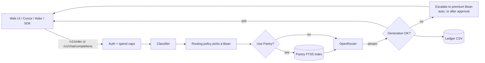

# Project Coffee

**A local AI model router that sends each prompt to the cheapest model that can handle it, and only escalates to a premium model when it has to.**

> Don't chase models. Build systems that outlive them.

Project Coffee runs on your own machine. It classifies every request, picks a model ("Bean") from [OpenRouter](https://openrouter.ai) based on a routing policy, streams the answer back, and escalates to a premium model if the cheap one truncates, refuses, or returns nothing. Every call is logged with its token count and cost, and hard daily spend caps keep the bill predictable.

You can use it two ways:

- **Through the built-in web chat** (Next.js), with sessions, file uploads, knowledge-base retrieval, and an approval card before any expensive escalation.
- **As an OpenAI-compatible endpoint** at `/v1/chat/completions`, so Cursor, Continue.dev, Aider, or the OpenAI SDK can route through it.

---

## Features

- **Task-aware routing.** A rule-based classifier tags each prompt by task type (`code`, `refactor`, `doc`, `analysis`, `research`, `explain`) and complexity, then a policy file maps that to a primary, fallback, and premium model.
- **Automatic escalation.** Failed generations (truncated, empty, or refused) are retried on the premium model. If the estimated cost is above a threshold you set, the web UI pauses and asks you first.
- **Spend caps and rate limits.** Per-user and global daily caps in USD, plus per-user requests per minute.
- **Cost ledger.** Every request is appended to `ledger/router_requests.csv` with model, tokens, cost, and escalation outcome.
- **Pantry retrieval.** A local SQLite FTS5 (BM25) index over `knowledge/` can be injected into prompts on request.
- **Learning loop.** Thumbs-style ratings (`good`, `needed_fixing`, `failed`) feed a policy rebuild that you preview and approve before it hot-swaps.
- **Vision and attachments.** Image, PDF, and text uploads, routed only to models that support them.
- **Secret guard.** The router refuses to start if a key-like string appears in its config files. The API key is read only from the environment.

## How it works



The backend is a FastAPI service on port `8765`. The web client is a Next.js app on port `3000`.

## Glossary

The codebase uses coffee names for its parts. Here's what each one means:

| Term | What it is |
| --- | --- |
| **Bean** | A model configuration: a friendly alias mapped to an OpenRouter model ID in `router/config/beans.yaml`. |
| **House Blend** | The default Bean for routine work. |
| **Second Pour** | The fallback Bean if the default is unavailable. |
| **Reserve Blend** | The premium Bean used for escalation. |
| **Order** | One request through `POST /v1/order`, streamed back as Server-Sent Events. |
| **Espresso Shot / Cold Brew** | Low-complexity vs. high-complexity task, as judged by the classifier. |
| **Pantry** | The local knowledge base in `knowledge/`, indexed for retrieval. |
| **Ledger** | Token and cost accounting (`ledger/`). |
| **Roastery / Cup Test** | The model benchmarking harness and its test prompts (`roastery/`). |
| **Tasting Notes** | Scorecards and observations from Cup Tests. |
| **Brew / Brew Log** | A development milestone, and the project memory that records them (`brew-log/`). |
| **Spill Guard** | Ignore rules and secret checks that keep sensitive files out of git and prompts. |
| **Draft quality** | A cheaper answer kept when an escalation was declined or blocked by a cap. |
| **Remember chat** | Per-session toggle that carries earlier turns into the context. |

The full vocabulary lives in [`COFFEE_TERMINOLOGY.md`](COFFEE_TERMINOLOGY.md).

---

## Quickstart

### Prerequisites

- Python 3.11 or newer
- Node.js 20 or newer, with npm
- An [OpenRouter API key](https://openrouter.ai/keys)
- Git

Windows is the primary development platform and has a one-command launcher. macOS and Linux work through the manual two-terminal steps below.

### 1. Clone

```bash
git clone https://github.com/ishan-suthar/Project-Coffee.git
cd Project-Coffee
```

### 2. Install dependencies

**Windows (PowerShell)**

```powershell
python -m pip install -r router/requirements.txt
python -m pip install pypdf charset_normalizer
cd web
npm install
cd ..
```

**macOS / Linux**

```bash
python3 -m pip install -r router/requirements.txt
python3 -m pip install pypdf charset_normalizer
cd web
npm install
cd ..
```

`pypdf` and `charset_normalizer` are used for PDF and text attachments. They aren't in `requirements.txt` yet, so install them separately.

### 3. Build the Pantry index and create a user

Run these from the repository root. The second command prompts for a username, display name, and password.

```bash
python router/tools/index_pantry.py
python router/tools/manage_users.py add
```

(Use `python3` on macOS/Linux.) Other user commands: `list`, `remove <username>`, and `set-cap <username> <amount|clear>`.

### 4. Set your OpenRouter key

The router reads the key **only from your shell environment**. It never reads it from a file, so don't put it in one.

**Windows (PowerShell)**

```powershell
$env:OPENROUTER_API_KEY = "sk-or-v1-your-key-here"
```

**macOS / Linux**

```bash
export OPENROUTER_API_KEY="sk-or-v1-your-key-here"
```

This lasts for the current terminal session only.

### 5. Start Coffee

**Option A: one command (Windows only)**

```powershell
.\start.ps1
```

This opens the router and the web UI in their own windows. Press `Ctrl+C` to stop both, or run `.\stop.ps1` to clean up anything left on ports 8765 and 3000.

**Option B: two terminals (any platform)**

Terminal 1, from the repository root (with the key set):

```bash
python -m uvicorn router.app.main:app --port 8765
```

Terminal 2:

```bash
cd web
npm run dev
```

Then open **http://localhost:3000** and sign in with the user you created. Use `localhost` rather than `127.0.0.1`, since the CORS and dev-origin settings key off that exact string.

### 6. Check it works

Get a session token:

**Windows (PowerShell)**

```powershell
$login = Invoke-RestMethod -Method Post -Uri http://localhost:8765/v1/login `
  -ContentType "application/json" `
  -Body '{"username": "your-username", "password": "your-password"}'
$login.token
```

**macOS / Linux**

```bash
curl -s -X POST http://localhost:8765/v1/login \
  -H "Content-Type: application/json" \
  -d '{"username": "your-username", "password": "your-password"}'
```

Then list the available Beans:

```bash
curl -s http://localhost:8765/v1/beans -H "Authorization: Bearer YOUR_TOKEN"
```

---

## Configuration

### Environment variables

| Variable | Required | Default | What it does |
| --- | --- | --- | --- |
| `OPENROUTER_API_KEY` | Yes | none | Your OpenRouter key. Read from the environment only. |
| `CORS_ALLOWED_ORIGINS` | No | `http://localhost:3000` | Comma-separated origins allowed to call the router. |
| `NEXT_PUBLIC_ROUTER_URL` | No | `http://127.0.0.1:8765` | Router URL the web UI calls. Restart `npm run dev` after changing it. |
| `COFFEE_LAN_IP` | No | see `start.ps1` | Comma-separated LAN IPs `start.ps1` uses for access from other devices. |
| `COFFEE_ROUTER_FORCE_ESCALATION` | No | unset | Set to `1` to force every generation to "fail" so you can test escalation. |

### Config files (`router/config/`)

- **`beans.yaml`**: the models. Each Bean has an alias, role, OpenRouter model ID, capabilities (`vision`, `code`, `tool_calling`), and pricing. Edit this to swap models.
- **`routing_policy.yaml`**: maps task types to Beans. It's generated by `python tools/generate_policy.py`, so don't hand-edit it.
- **`settings.yaml`**: everything else. The ones you'll most likely change:

| Setting | Default | Meaning |
| --- | --- | --- |
| `per_user_daily_cost_cap_usd` | `1.00` | Daily spend cap per user (resets at UTC midnight) |
| `global_daily_cost_cap_usd` | `5.00` | Daily spend cap across all users |
| `per_user_requests_per_minute` | `20` | Rate limit per user |
| `escalation_cost_cap_usd` | `0.50` | Above this estimate, escalation needs your approval |
| `pantry_top_k` | `5` | Knowledge chunks injected per query |
| `history_max_messages` | `20` | Turns kept when "Remember chat" is on |
| `shadow_mode_enabled` | `false` | Quietly compare cheap answers against the premium model |

See [`EXPLORATION.md`](EXPLORATION.md) for the full settings list.

---

## Using Coffee from other tools

All clients use the router as an OpenAI-style base URL, with the token from `/v1/login` as the API key. Tokens last 30 days.

A few differences from a normal OpenAI endpoint:

- The `model` field is ignored unless it exactly matches a Bean alias (like `"Reserve Blend"`). Otherwise Coffee picks the model itself.
- The endpoint is stateless. Your client sends the full history each turn.
- Over-cap escalations can't pause for approval here, so they're declined and the draft answer is returned.

### OpenAI Python SDK

```python
from openai import OpenAI

client = OpenAI(
    base_url="http://localhost:8765/v1",
    api_key="YOUR_TOKEN",  # from POST /v1/login
)

response = client.chat.completions.create(
    model="House Blend",
    messages=[{"role": "user", "content": "Explain how Coffee routes models."}],
)
print(response.choices[0].message.content)
```

### Cursor

Settings > Models > OpenAI API Key: paste your token, and set the Base URL to `http://localhost:8765/v1`.

### Continue.dev

```yaml
models:
  - name: Coffee
    provider: openai
    model: House Blend
    apiBase: http://localhost:8765/v1
    apiKey: YOUR_TOKEN
```

### Aider

```bash
aider --openai-api-base http://localhost:8765/v1 --openai-api-key YOUR_TOKEN --model "openai/House Blend"
```

<!-- The Aider command follows Aider's standard OpenAI-compatible setup; it isn't covered by the repo's own tests. -->

---

## Running tests

Python suites (router, tools, Roastery, and apps):

```bash
python tools/run_all_tests.py
```

Web client (run `npm install` in `web/` first):

```bash
cd web
npm run test        # Vitest component tests
npm run test:e2e    # Playwright smoke tests against a mocked router
npm run lint
npx tsc --noEmit
```

Repository health and release checks:

```bash
python tools/coffee.py doctor
python tools/coffee.py release-check
```

---

## Status and known limitations

Coffee is a working personal tool released as-is. It's used daily, but it isn't hardened for multi-tenant or production hosting. Things to know:

- **Windows first.** `start.ps1` and `stop.ps1` are PowerShell-only. On macOS and Linux, use the two-terminal steps.
- **A few failing tests.** Some router tests fail for reasons unrelated to runtime behavior: hardcoded fixture dates in the ledger tests, timestamp collisions on Windows' coarse clock, and a vision test written before vision-capable Beans were added.
- **Model data location.** Some optional Beans in `beans.yaml` (Kimi K2, DeepSeek V3.2) are served by providers based in China. Review where your data goes before routing sensitive work through any Bean.
- **Free-tier models change.** OpenRouter's free models come and go, so a Bean's model ID may need updating in `beans.yaml`.
- **Local network access is unauthenticated at the network level.** Anyone who can reach ports 8765 and 3000 can reach the login screen. Keep it on a trusted network.

## Project layout

```
router/      FastAPI router, config, tests, and admin tools
web/         Next.js chat client
roastery/    Model benchmarking harness (Cup Tests)
knowledge/   Pantry knowledge base indexed for retrieval
ledger/      Cost and token logs
tools/       CLI (coffee.py), policy generator, test runner
brew-log/    Project memory and progress notes
DECISIONS/   Architecture decision records
docs/        Design documents
```

The design and philosophy documents at the root (`VISION.md`, `ARCHITECTURE.md`, `COFFEE_PRINCIPLES.md`, and others) explain why Coffee is built the way it is.

## Contributing

Issues and pull requests are welcome.

1. Fork the repo and create a branch.
2. Make your change, with tests where it makes sense.
3. Run `python tools/run_all_tests.py` (and the web tests if you touched `web/`).
4. Check that nothing secret is staged:
   ```bash
   git diff --cached | grep -E "sk-or-v1-|sk-[A-Za-z0-9_-]{20,}|ghp_"
   ```
5. Open a pull request describing what changed and why.

Never commit API keys, `.env` files, or anything from `router/data/`.

## License

[MIT](LICENSE) © 2026 Ishan Suthar
